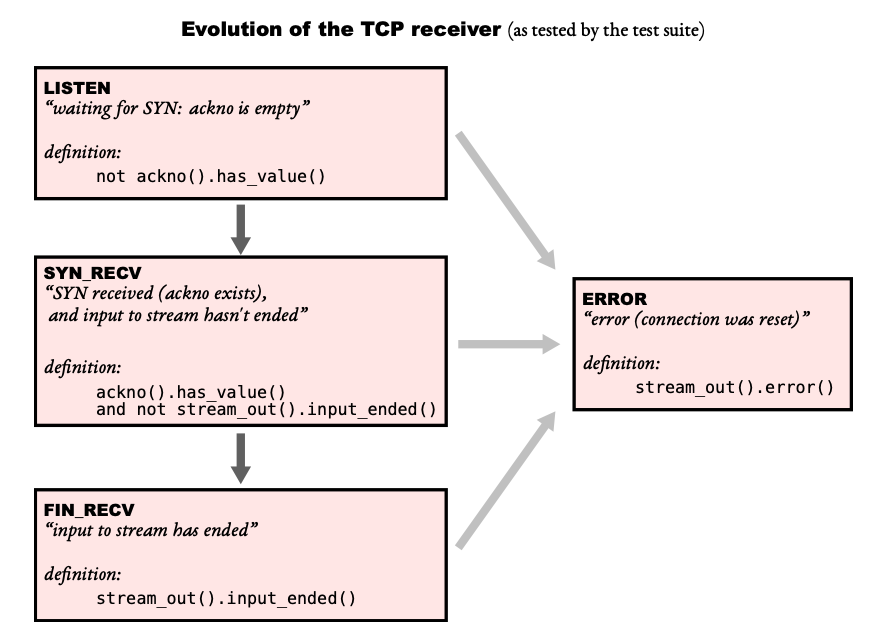
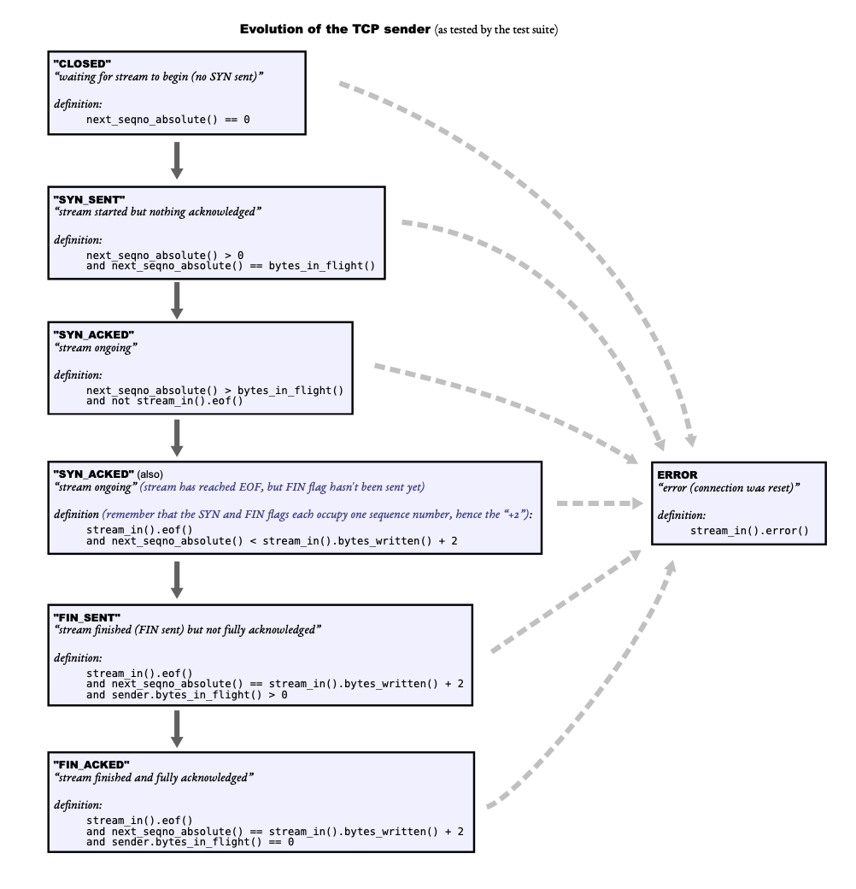
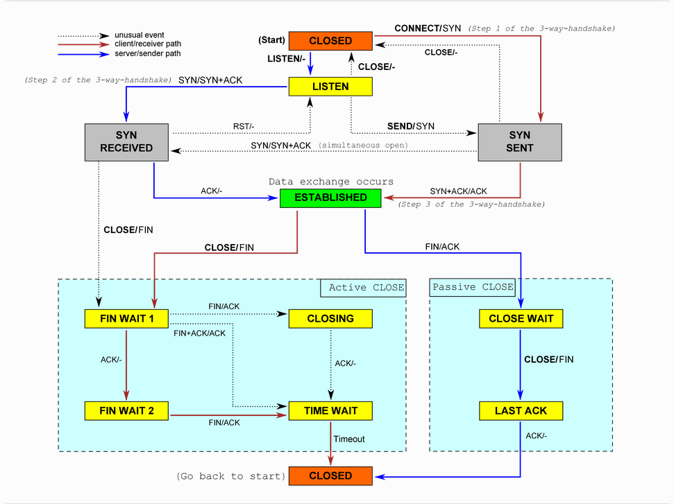

# CS144 TCP

> 相关内容，查看pdf文件

[toc]


必须看：

* lab相关PDF
* 《Computer Networking A Top Down Approach》8th,edition

前置条件：

* 实验在Ubuntu20运行
* gcc版本9.4.0

## lab0: networking warmup

### An in-memory reliable byte stream

* Fetch a Web page - telnet 到服务器，发送标准的http报文，国内网络访问有点困难

* Send yourself an email - 完全没法做

* Listening and connecting - 本地模拟server and client

* stream socket - 使用socket connect ，然后开始write http请求（特别注意空格，一定要按照HTTP规范）。然后在while里判断是否eof，否则进行read，是则close

* 被现在这些框架绑架，这些原生的socket请求一开始都不会

* 这测试大概率过不了，因为网络的原因和webget_t.sh

* an in-memory reliable byte stream - 写入的顺序和读出的顺序一致，不需要担心并发问题

* 思考三天左右，知道应该使用队列，queue还是deque。queue和deque的interface，CPP和java还不太一样，CPP没有peek。queue只能访问头元素，所以选择deque

* 定义'capacity'、'input_end_flag'、‘read_count’、'write_count'，每次写入和读取的时候，都要结合capacity和已经进入deque的size综合判断，不能超了，也就达到了"be able to handle streams that are much longer than the capacity"

* 人生第一次写复杂点的CPP代码，被这些"_", “::”符号搞怕了，并且完全没有头绪。构造函数不会，string赋值不会，可太难了

* 在vscode里编码，debug的时候需要更改
  
  ```json
  "program": "${workspaceFolder}/build/tests/${fileBasenameNoExtension}"”
  ```

## lab1: stitching substrings into a byte stream

### Putting substrings in sequence

* 应对以上情况，实现一个 stream  reassembler，结合lab1 的figure 1棕色部分，进入byte stream前先做处理，把碎片变成一个contuguous stream

* 要把lost、reordered、altered、duplicated变成一个持续的流，没看API之前感觉可太难了，完全没有思路，看了push_substring 的参数，index-data中的索引值，eof-是否是data中的最后一段，这就够了吗？想了我一周没想明白，最后参考了别人的博客

* 首先定义一个node，里面包括index、length、data、<(排序规则，按索引升序)，然后node存在红黑树中，每次插入判断是否能够前后合并，使用std::set

* 对capacity的理解，“The StreamReassembler will own a ByteStream for the output: as soon as the reassembler knows the next byte of
  the stream, it will write it into the ByteStream.” 这话里头的“ByteStream”是lab0中实现的”ByteStream“。read到ByteStream 和 assembled的总和，构成capacity，3.1节中的图很重要，简单理解，蓝色是混乱的，绿色(fisrt unread ~ first unassembled)开始处理混乱，处理完后减少，并增长红色的。红色(first unassembled ~ first unacceptable)是可以使用的，从绿色的stream output越多，red越长

* 需要一个额外的merge函数，来合并两个node，并返回合并后的长度。先进行比较，在前面的给x，后面的给y，合并需要处理的情况 
  
  1. x与y没有交集
  
  2. x包含y
  
  3. x与y相交

* push_string() 函数处理的流程类似，需要初始化一个head_index(first unassembled)指针，先判断index是否超出head_index + capacity，然后处理多出的string，得出的length 加入到unassembled中，然后开始merge next和prev，然后写到output中。这里写得很糟糕，看了别人博客后，学到了很多。merge next结束后，发现回到了_blocks.begin，应该直接break，否则继续merge prev，普通的做法是if/else，但更近一步的做法，可以是 do {...}while(false)，方法只执行一次，但可以在中间break，简直是神作！！！ google一番后发现，c语言的宏里面有类似的写法。同时，人生第一次使用了goto语句，代码简洁了不少。传统观念的都是让你禁止使用goto语句，但更正确的方式是"it depends"，包括Linux内核代码也有不少goto用法

* 这个测试过了之后，只能说可能通过，后面大概率还要回来改的

## lab2: the TCP receiver

### The TCP Receiver

* ackno-first unassembled, window size - (first unassembled,first unacceptable) 这俩实现了flow control，receiver tell sender "what range of indices is the reveiver interested and willing to receive"

* wrap and unwrap，wrap还是简单，好吧，CPP里的强制类型转换不会。unwrap需要理解checkpoint，不能出现两个segment序号超过INT32_MAX的情况。先计算出offset，然后把checkpoint后32位变零(&运算)，再相加，然后与checkpoint相减。在1 << 32范围内校验，可以查看测试用例反推

开始实现Receiver

* the sequence number, the payload, the SYN and FIN flags, 由sender发送，receiver 接收

* window_size()比较简单,就是红格的值
  
  ```cpp
  _capacity - _reassembler.stream_out().buffer_size(); 
  ```

* ackno()就是lab1 的head_index，根据‘length in sequence space()’方法可知，还需要判断是否有FIN flags，根据lab1 中的stream 是否input_ended来判断。这俩方法都需要在reassembler中额外写

* segment_received() 先初始化 Initial Sequence Number(isn)，copy payload。计算index比较复杂，需要unwrap，checkpoint是head_index，isn是初始化的_isn，n(relative sequence number)指header的seqno，并且包括SYN/FIN

* testcase非常需要关注，debug了无数次，CPP的debug相比java，非常难搞

* 多读“Computer Networking A Top Down Approach”的第三章

## lab3: the TCP sender

### The TCP Sender

* 看完讲义一头雾水，无从下手

* 参考博客后开始理解。Sender的retransmission基于“ARQ”协议，TCP Sender的简单描述，见书Figure 3.33

* 从简单的开始，void send empty segment()
  
  ```cpp
  wrap(_next_seqno, _isn)
  ```
  
  push 到 "_segments_out"

* bytes_in_flight() 这里需要理解Sender的windowSize的组成，‘except_ack’为window left
  
  ```cpp
  // ---[_expect_ack]-- flight -- [_next_seqno]-- -- [windown_edn]--
  ```

* tick() 方法，这里面有几个时间相关的需要注意，最后这里记录"consecutive
  retransmissions"
  
  1. timer初始化为0，只在tick中累加，也就是讲义说的"Use this to maintain a notion of the total number of milliseconds the TCPSender has been alive"
  
  2. _initial_retransmission_timeout，构造器中初始化，自始至终不变
  
  3. back_off++，指数回退
  
  4. retransmission timeout (即RTO)，会改变，在这里，当timer大于它且有segment没有ack时，
     
     ```cpp
     _retransmission_timeout = _timer + (_initial_retransmission_timeout << _rto_back_off); 
     ```

* ack_received()
  
  * 判断window_size是否为0，并重置do_back_off
  
  * unwrap出新的[left,right]
  
  * 根据bytes_in_flight判断是否reopen或close timer
  
  * 移除所有acked的segment

* fill_window()
  
  - 如果syn_flag为false，即尚未开始，先初始化。发送syn，设置_next_seqno，设置retransmission timeout。因为是ARQ协议，所以还需要向outstanding queue里push
  
  - 处理正常发送逻辑，每次发送segment后，要重新计算next_seqno，且重新计算剩余多少。如果stream eof成立，设置fin为true
  
  - except_ack为相对值，故存在收到重复的ack，即except_ack为0，需要增加相关判断，testcase里会出现
  
  - 根据需要打开Timer

* 再一次的，一边debug一边改代码，cornor case太多

## lab4: the summit (TCP in full)

### The TCP connection

* 这一次的测试，把前几个lab的bug全暴露出来了，最后的测试没通过，可能跟网络有一定的关系，但大概率没关系，改到最后，就是用普通网络测试的，每次都通过

* 这次再根据test case来改代码虽然可行，但会很费劲，脚本+代码的测试的共160+，只有把全链路都吃透，TCP的状态机也吃透
  
  
  
  



1. "CLOSED" ---> "SYN_SENT"：               client        send        SYN

2. "LISTEN" ---> "SYN_RECEIVED"：         server       recv        SYN            send    SYN+ACK

3. "SYN_SENT" ---> "ESTABLISHED"：      client        recv        SYN+ACK   send    ACK

4. "SYN_RECEIVED"---> "ESTABLISHED":  server      recv        ACK


1. "ESTABLISHED" ---> "FIN_WAIT_1":      client        send      FIN

2. "ESTABLISHED" ---> "CLOSE_WAIT"： server      recv       FIN          send         ACK

3. "FIN_WAIT_1" ---> "FIN_WAIT_2":         client        recv       ACK

4. "CLOSE_WAIT" ---> "LAST_ACK":          server      send      FIN

5. "FIN_WAIT_2" ---> "TIME_WAIT":          client        recv       FIN         send        ACK

6. "LAST_ACK" ---> "CLOSED":                   server      recv       ACK

以上是正常情况下的流程，PS：上面这图虽然流传很广，画得也美，但是看懂还是需要点时间


* 简单的三个先处理完，remaining outbound capacity(), bytes in flight(), and unassembled bytes()

* connect()，对应上图的"CONNECT/syn"，即第一个handshake。调用fill_window()，附上SYN，然后发送，即push到connection的_segments_out。这里先定义send_segments()方法，除了判断是否需要发送外，还需要判断head上是否需要赋值ack(almost every TCPSegment has an ackno，特别在outgoing segments)，window_size，rst这些

* write()，写入data到sender的stream_in，同时需要fill_window和send segment

* end_input_stream()，sender 的 stream_in执行end_input()，发送相关的，都需要fill_window 并且发送segment。这过程属于"FIN_SENT"，byte_in_flight还是大于0

* segment_recived()，先判断是否active，设置syn_flag值，表示连接已建立，_time_since_last_segment_received置0。如果收到的head中有rst，在inbound 和 outbound 设置error，active 返回false，但不一定要发送，此过程对应了“RST/-”。然后receive接收segment，如果seg里有ack，且还未closed(next_seqno_absolute)，对应的是“SYN+ACK/ACK”，_send_ack_reeived()。如果closed，对应的是最右边的"ACK/-"。如果syn_flag设置里，需要调用fill_window。并且根据情况是否发送空的ACK

* tick()，_time_since_last_segment_received持续累加，调用send的tick，如果太多的consecutive retransmissions，设置rst，发送send_segment()

* 还有非常重要一点，需要确认TCP connection 是否 done，即clean shutdown，直接参考5.1节
  
  1. The inbound stream has been fully assembled and has ended.
  
  2. The outbound stream has been ended by the local application and fully sent (including the fact that it ended, i.e. a segment with fin ) to the remote peer.
  
  3. The outbound stream has been fully acknowledged by the remote peer.
  
  4. The local TCPConnection is confident that the remote peer can satisfy prerequisite 3。但是这里有两个可能的情况发生
     
     * 在两边stream都结束后徘徊(lingering)。在1到3满足的情况下，remote peer似乎已经得到了local peer 的ack。但是local peer 是不确定的，因为TCP不保证ack 可靠，即not ack acks。local peer等了一段时间并且没有收到任何传输后，才会肯定remote peer 已经得到ack。具体来说，至少是初始重传超时的10倍。也意味着TCPConnection 需要stay alive 一段时间，独占本地端口，即使TCPSender he TCPReceiver已经完全结束，并且stream也完全end。PS：这里对应"TIME_WAIT" --> "CLOSED"，且发生在client。
     
     * 被动关闭。在1到3满足的情况下，并且local peer 100%确定remote peer满足3。如果TCP 没有收到ack acks，为什么可以确认。因为remote peer是第一个end its stream。 

* 补充：Two Generals Problem
  
  两只由不同的将军领导的军队，正准备进攻一座坚固的城市。军队在城市附近的两个山谷扎营。由于有了一个山谷将两个山丘隔开，两个将军交流的唯一方法是派遣信使穿越山谷。然而，这座山谷被城市的守卫者占领，并且有可能会俘虏途径该山谷传递资讯的任意信使。尽管两位将军已经约定要同时发起进攻，但尚未约定进攻的具体时间点。要使攻击顺利，两支军队必须同时进攻城市。如果同一时间仅一组军队进攻，将会战败。因此，两位将军须通过沟通约定攻击时间，并且他们都必须确保另一位将军知道自己已同意了进攻计划。但由于传递确认讯息的信使与传递原始讯息的信使一样，都可能被俘虏造成讯息遗失，即使双方不断确认已收到对方的上一条资讯，也无法确保对方已与自己达成共识。
